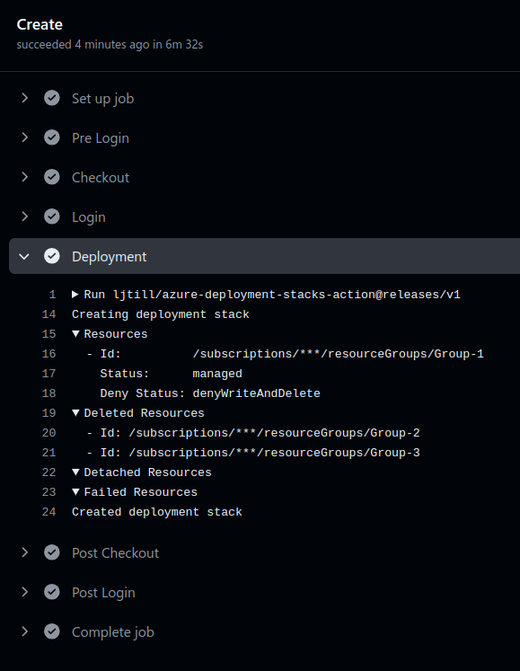

# Azure Deployment Stacks Action


[](https://github.com/super-linter/super-linter)

[](https://github.com/ljtill/azure-deployment-stacks-action/actions/workflows/check-dist.yml)
[](https://github.com/ljtill/azure-deployment-stacks-action/actions/workflows/codeql-analysis.yml)
[](./badges/coverage.svg)

This repository contains a [GitHub Action](https://docs.github.com/actions) that
allows engineers to create, update, delete, validate and export
[Azure Deployment Stacks](https://learn.microsoft.com/azure/azure-resource-manager/bicep/deployment-stacks)
directly from their GitHub workflows. It supports a variety of inputs for scopes
and options, making it flexible and easy to use for managing Azure resources.
Whether you need to define the scope at the management group, subscription, or
resource group level, this action provides the necessary parameters to tailor
deployments to your specific needs. Additionally, it includes options for
setting the location, mode, and handling unmanaged resources, as well as
configuring deny settings and specifying ARM or Bicep templates. This GitHub
Action streamlines the process of managing Azure infrastructure, enabling
efficient and automated deployments.

## Getting Started

```yaml
- name: Login
  uses: azure/login@v2
  with:
    client-id: ${{ secrets.AZURE_CLIENT_ID }}
    tenant-id: ${{ secrets.AZURE_TENANT_ID }}
    subscription-id: ${{ secrets.AZURE_SUBSCRIPTION_ID }}

- name: Deployment
  uses: ljtill/azure-deployment-stacks-action@v1
  with:
    name: 'Microsoft.Samples'
    description: 'Sample description for the Deployment Stack'
    location: uksouth
    scope: subscription
    mode: create
    actionOnUnmanage: deleteAll
    denySettings: denyWriteAndDelete
    subscriptionId: ${{ secrets.AZURE_SUBSCRIPTION_ID }}
    templateFile: ./src/main.bicep
    parametersFile: ./src/main.bicepparam
    wait: true
```

## Authentication

The default method for authentication involves using the
[`azure/login@v2`](https://github.com/azure/login) action as an initial step.
However, since our codebase relies on the Azure SDK, we utilize the
[DefaultAzureCredential](https://learn.microsoft.com/azure/developer/javascript/sdk/authentication/overview)
chain within the application. This approach enables us to integrate additional
authentication methods like WorkloadIdentityCredential and ManagedIdentity,
which are especially beneficial when executing jobs on Self-Hosted Agents.

## Modes

The action supports three modes: `create`, `delete` and `validate`.

For `create` mode, it is recommended to use it with `push` triggers. This setup
ensures that whenever changes are pushed to the repository, the action
automatically creates or updates the Azure Deployment Stack accordingly. This is
ideal for continuous integration and deployment workflows, where infrastructure
changes should be applied seamlessly as part of the development process.
Additionally, this will delete or detach resources that are no longer defined
within the Deployment Stack.

For `delete` mode, it is recommended to use it with `workflow_dispatch`
triggers. This setup allows for manual initiation of the delete process through
the GitHub Actions interface. Using `workflow_dispatch` triggers provides
greater control and prevents accidental deletions, ensuring that stacks are only
deleted when explicitly requested by an authorized user. This is particularly
useful for maintenance tasks or cleanup operations, where automated deletion
could pose risks.

For `validate` mode, it is recommended to use it with `pull_request` triggers.
This ensures that the Azure Deployment Stack is validated whenever a pull
request is created or updated. By integrating validation into the pull request
workflow, you can catch potential issues or misconfigurations before they are
merged into the main branch. This setup is ideal for ensuring the quality and
integrity of infrastructure changes, as it allows for early detection of errors
and provides an opportunity to review and address issues collaboratively. This
approach helps maintain a stable and reliable infrastructure by preventing
problematic changes from being integrated into the production environment.

## Workflows

The following samples provide end-to-end implementations of the Azure Deployment
Stamps Action:

- [Create](./docs/WORKFLOWS.md#create)
- [Delete](./docs/WORKFLOWS.md#delete)
- [Validate](./docs/WORKFLOWS.md#validate)

## Execution

As the action executes it's operations it will report the `Resources`,
`Deleted Resources`, `Detached Resources`, `Failed Resources` within the
workflow logs.



## Customisation

For a complete list of customisation options, please refer to the
[Parameters](./docs/PARAMETERS.md) document.

## Documentation

- [Deployment Stacks](https://learn.microsoft.com/azure/azure-resource-manager/bicep/deployment-stacks)
